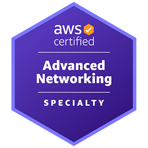
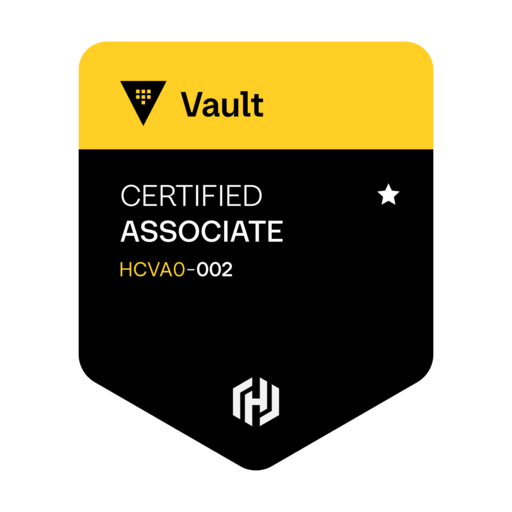
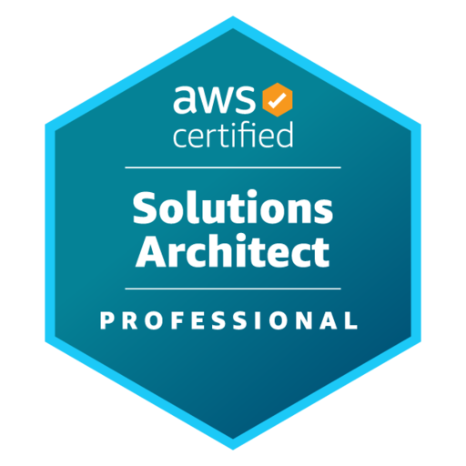
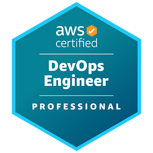
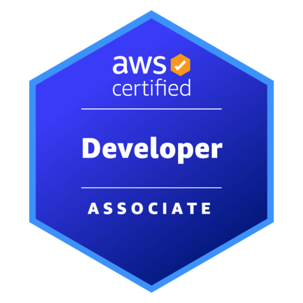
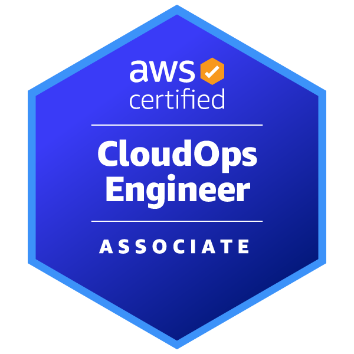

# Nicole Paixão
**DevOps Engineer | Cloud Architecture | Infrastructure Automation**

São Paulo, Brazil 🇧🇷

---

## Education

**BSc in Systems Analysis and Development**  
Fatec Taubaté (Brazil) | Dec/2024

**Postgraduate in Distributed Software Architecture**  
PUC Minas (Brazil) | Apr/2025 - Mar/2026

---

## Certification Journey

### AWS Security & Networking Specialist

<strong> SCS-C02</strong> • <strong> ANS-C01</strong>

 
 
 

### Kubernetes Specialist

<strong> KCNA</strong> • <strong> KSNA</strong> • <strong> CKA</strong> • <strong> CKAD</strong> • <strong> CKS</strong>

 
 
 

### Infrastructure as Code & Linux

<strong>  TA-004</strong> • <strong>  Vault-004</strong> • <strong>  SAP-C02</strong> • <strong>  DOP-C02</strong> • <strong>  LFCS</strong> • <strong>  LFCE</strong>

 
 
 

### Cloud Foundation

<strong><a href="certifications/finops-focp.md">  FOCP</a></strong> • 
  <strong><a href="certifications/aws-clf-c02.md">  CLF-C02</a></strong> • 
  <strong><a href="certifications/aws-saa-c03.md">  SAA-C03</a></strong> • 
  <strong>  SOA-C03</strong> • 
  <strong>  DVA-C02</strong> •
  <strong>  GitHub Foundations</strong>

---

## Languages

🇧🇷 **Portuguese** - Native  
🇺🇸 **English** - Professional  
🇪🇸 **Spanish** - Basic
