## <samp>Education</samp>

<samp>**BSc in Systems Analysis and Development** · Fatec Taubaté · Dec/2024</samp>

<samp>**Postgraduate in Distributed Software Architecture** · PUC Minas · Apr/2025 – Mar/2026</samp>

- - -

## <samp>Languages</samp>

<samp>🇧🇷 🇺🇸 🇪🇸 Advanced · 🇮🇹 Basic</samp>

- - -

## <samp>Certification Journey</samp>

<samp>Badges at full opacity are completed — linked to study notes. Grayed out are next on the path.</samp>

### <samp>Cloud Foundation</samp>

&nbsp;&nbsp;
&nbsp;&nbsp;
&nbsp;&nbsp;
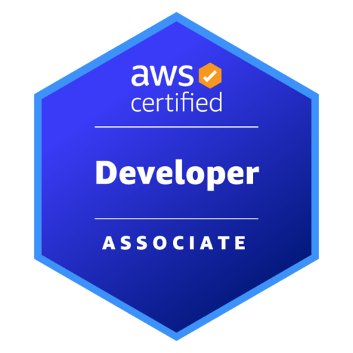&nbsp;&nbsp;
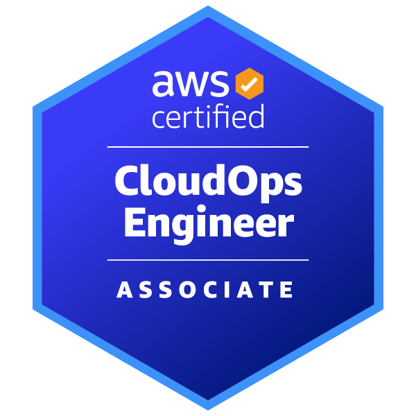&nbsp;&nbsp;

 
<samp>
<a href="certifications/finops-focp.md">FOCP</a>&nbsp;&nbsp;·&nbsp;&nbsp;
<a href="certifications/aws-clf-c02.md">CLF-C02</a>&nbsp;&nbsp;·&nbsp;&nbsp;
<a href="certifications/aws-saa-c03.md">SAA-C03</a>&nbsp;&nbsp;·&nbsp;&nbsp;
<i>DVA-C02</i>&nbsp;&nbsp;·&nbsp;&nbsp;
<i>SOA-C03</i>&nbsp;&nbsp;·&nbsp;&nbsp;
<i>GitHub Foundations</i>
</samp>

  

### <samp>AWS Professional & Specialty</samp>

&nbsp;&nbsp;
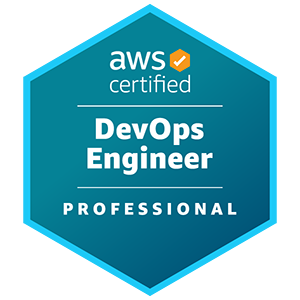&nbsp;&nbsp;
&nbsp;&nbsp;
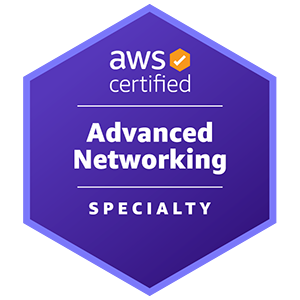

 
<samp>
<i>SAP-C02</i>&nbsp;&nbsp;·&nbsp;&nbsp;
<i>DOP-C02</i>&nbsp;&nbsp;·&nbsp;&nbsp;
<i>SCS-C02</i>&nbsp;&nbsp;·&nbsp;&nbsp;
<i>ANS-C01</i>
</samp>

  

### <samp>Infrastructure as Code</samp>

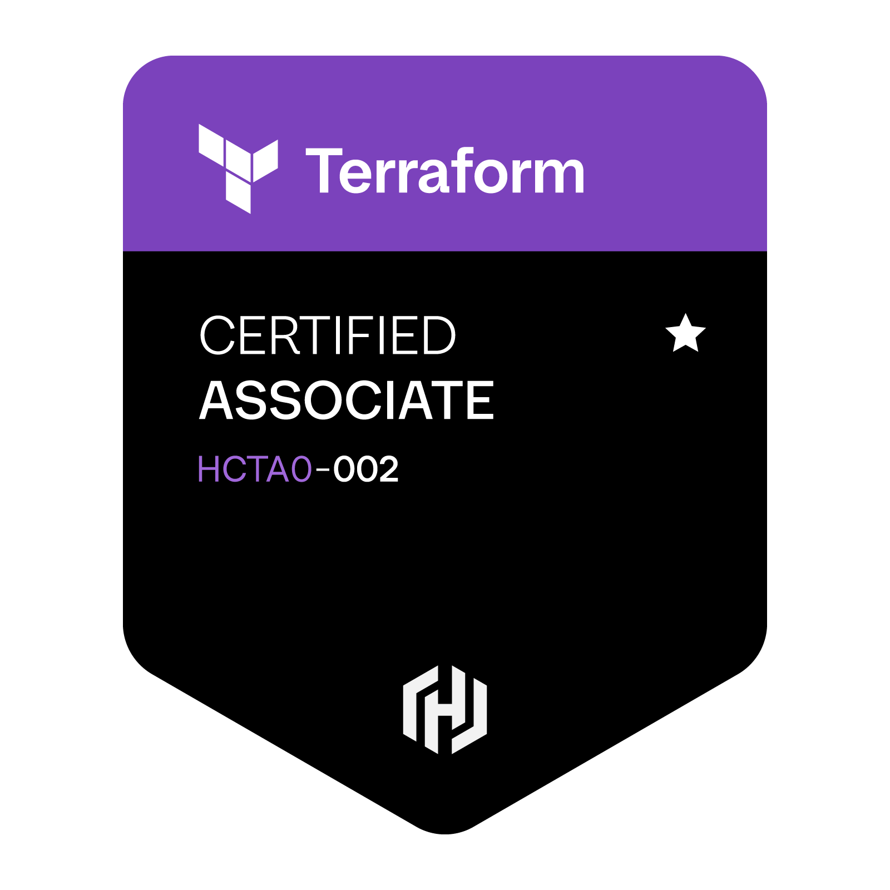&nbsp;&nbsp;
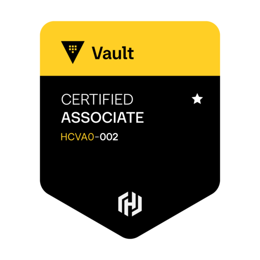

 
<samp>
<i>TA-004</i>&nbsp;&nbsp;·&nbsp;&nbsp;
<i>Vault-004</i>
</samp>

  

### <samp>Kubernetes</samp>

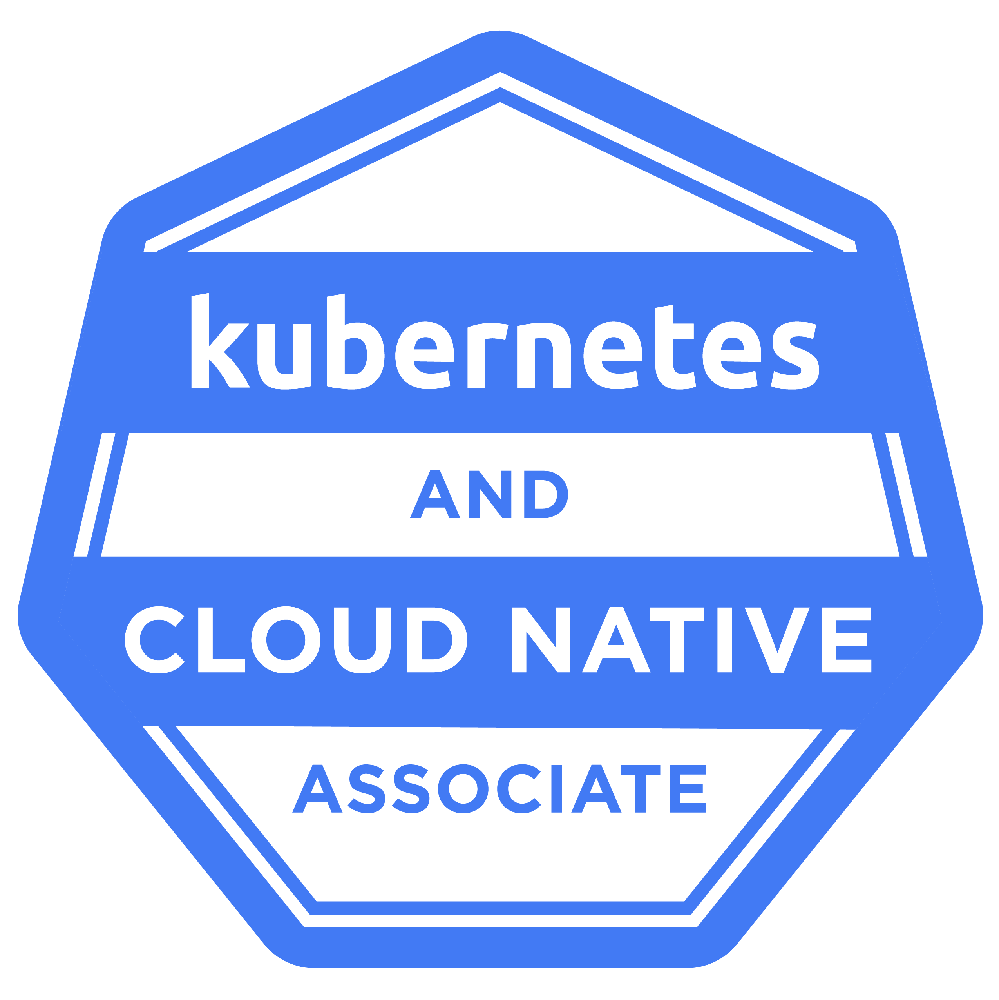&nbsp;&nbsp;
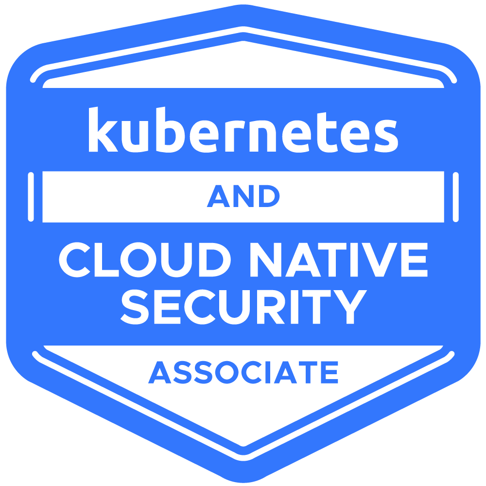&nbsp;&nbsp;
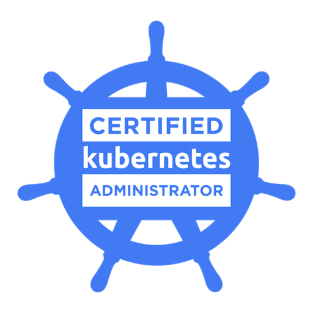&nbsp;&nbsp;
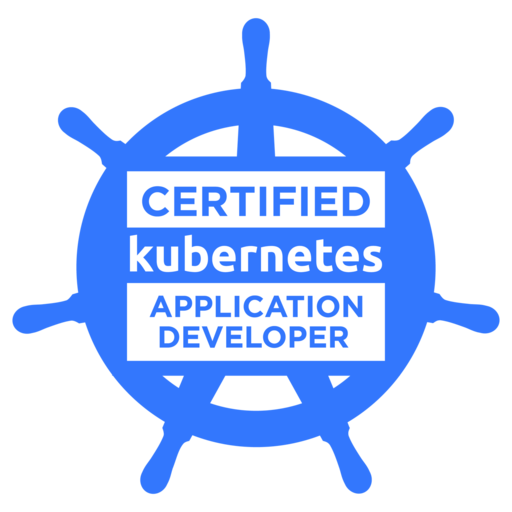&nbsp;&nbsp;

 
<samp>
<i>KCNA</i>&nbsp;&nbsp;·&nbsp;&nbsp;
<i>KSNA</i>&nbsp;&nbsp;·&nbsp;&nbsp;
<i>CKA</i>&nbsp;&nbsp;·&nbsp;&nbsp;
<i>CKAD</i>&nbsp;&nbsp;·&nbsp;&nbsp;
<i>CKS</i>
</samp>

  

### <samp>Linux</samp>

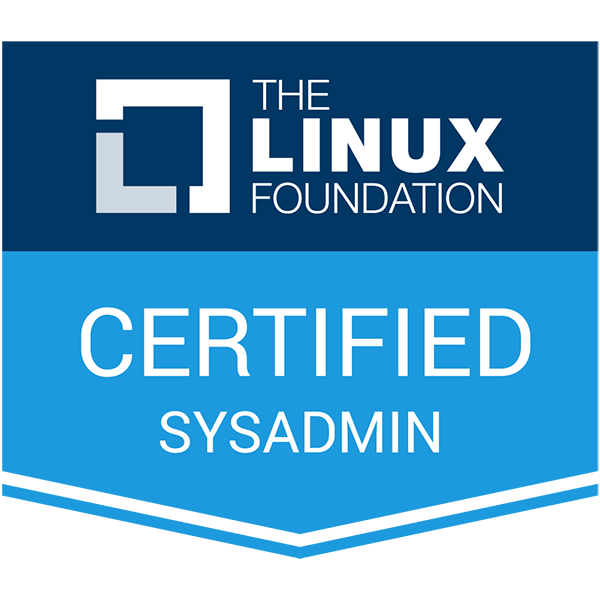&nbsp;&nbsp;

 
<samp>
<i>LFCS</i>&nbsp;&nbsp;·&nbsp;&nbsp;
<i>LFCE</i>
</samp>

