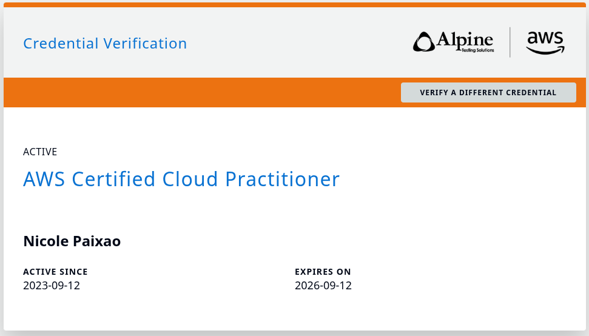

# <samp>AWS Certified Cloud Practitioner</samp>

<samp>Amazon Web Services · September 12, 2023 · <a href="https://aws.amazon.com/verification/SZ1XNE024EBQQHWP">Verify credential</a></samp>

- - -

<samp>This was the first one. Not the hardest, not the most technical — but the one that made everything feel real. Before CLF-C02, AWS was a list of service names. After it, it started to feel like a language I was beginning to speak.</samp>

- - -

## <samp>projects I built while studying</samp>

| repo | what it does |
|------|-------------|
| [aws-ec2-web-server-complete](https://github.com/nicoleepaixao/aws-ec2-web-server-complete) | First real EC2 setup — Apache + Nginx, SSL, CloudWatch Logs, security groups from scratch |
| [aws-s3-static-site-with-cloudfront](https://github.com/nicoleepaixao/aws-s3-static-site-with-cloudfront) | S3 + CloudFront + Route53 — the CLF scenario that actually stuck because I built it |
| [aws-cloudwatch-monitoring-base](https://github.com/nicoleepaixao/aws-cloudwatch-monitoring-base) | CloudWatch dashboards, alarms, and SNS — understanding observability before it got complex |

- - -

## <samp>certificate</samp>

- - -

<samp>next → [FinOps Certified Practitioner (FOCP)](finops-focp.md)</samp>

[← back](../README.md)
