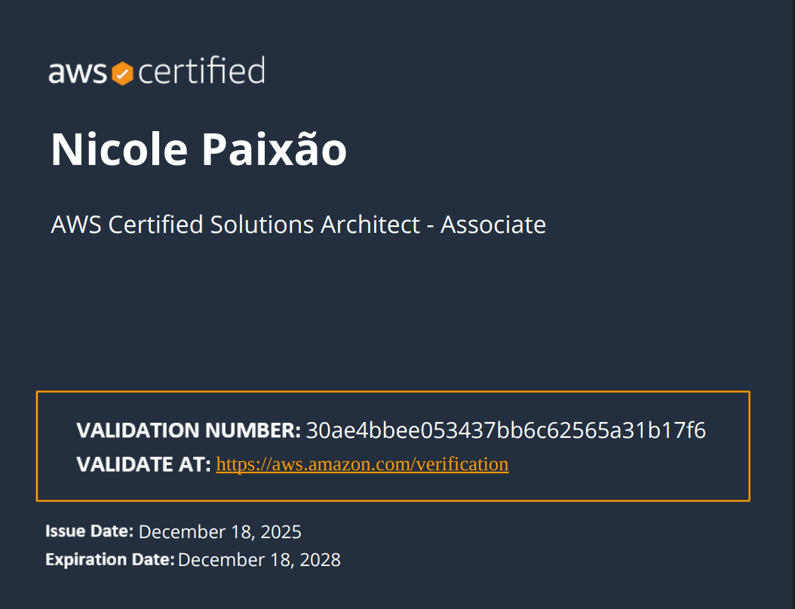

# <samp>AWS Certified Solutions Architect – Associate</samp>

<samp>Amazon Web Services · December 18, 2025 · <a href="https://www.credly.com/badges/30ae4bbee053437bb6c62565a31b17f6">Verify credential</a></samp>

- - -

<samp>SAA-C03 was the exam that forced me to stop thinking in individual services and start thinking in architectures. The difference between knowing what EC2 is and knowing when to use EC2 vs Lambda vs Fargate — and being able to justify it — that's what this certification is really about.</samp>

- - -

## <samp>how I studied</samp>

- [AWS SAA-C03 Simulados Explicados](https://www.udemy.com/course/aws-solutions-architect-saa-c03-simulados-explicados/) · Udemy
- AWS Well-Architected Framework documentation

- - -

## <samp>projects I built while studying</samp>

| repo | what it does |
|------|-------------|
| [aws-multi-tier-vpc-app](https://github.com/nicoleepaixao/aws-multi-tier-vpc-app) | VPC with public/private/isolated subnets, ALB, EC2, RDS — the classic SAA architecture built for real |
| [aws-ha-alb-autoscaling](https://github.com/nicoleepaixao/aws-ha-alb-autoscaling) | ALB + Auto Scaling Multi-AZ with scale-in/out tested under load |
| [aws-ha-nlb-autoscaling](https://github.com/nicoleepaixao/aws-ha-nlb-autoscaling) | NLB Layer 4 with static IPs — documents exactly when NLB beats ALB |
| [aws-s3-static-site-with-cloudfront](https://github.com/nicoleepaixao/aws-s3-static-site-with-cloudfront) | S3 + CloudFront + OAC + Lambda@Edge — the SAA scenario done properly |
| [aws-backup-ami-automation](https://github.com/nicoleepaixao/aws-backup-ami-automation) | Multi-service backup policies with cross-region copy and tested restore |
| [aws-route53-dns-management](https://github.com/nicoleepaixao/aws-route53-dns-management) | All routing policies (weighted, latency, failover, geolocation) with real failover tested |

- - -

## <samp>certificate</samp>

- - -

<samp>next → [AWS Certified Developer Associate (DVA-C02)](aws-dva-c02.md)</samp>

[← back](../README.md)
