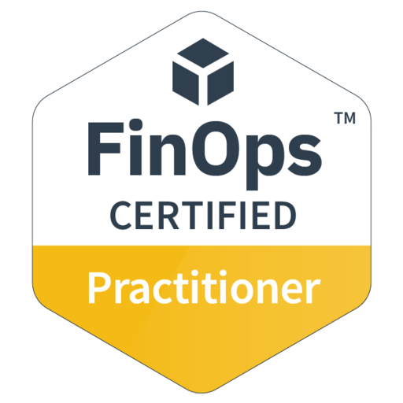

# FinOps Certified Practitioner (FOCP)

**Cloud Financial Management & Cost Optimization**

**Issued by:** FinOps Foundation  
**Certification Date:** October 26, 2025  
**Credential ID:** wwnpbgs86uip  
**Verify:** [https://verify.skilljar.com/c/wwnpbgs86uip](https://verify.skilljar.com/c/wwnpbgs86uip)

[← Back to Main Profile](../README.md)

*Click [here](certificates/finops-certificate.png) to view full certificate*

## 📚 Study Resources

### Official Training
- **FinOps Foundation Certified Practitioner Training** - FinOps Foundation - Duration: 8h
- **Introduction to FinOps** - Linux Foundation - Duration: 4h

### Online Courses
- **FinOps na AWS: Economizando e Gerenciando Custos na Nuvem** - Udemy - [Course Link](https://www.udemy.com/course/finops-na-aws-economizando-e-gerenciando-custos-na-nuvem/)
- **FinOps Certified Practitioner (FOCP) Exam Preparation** - Udemy - [Course Link](https://www.udemy.com/course/finops-certified-practitioner-focp-exam-preparation/)

### Books & Documentation
- **Cloud FinOps** by J.R. Storment & Mike Fuller
- FinOps Framework Documentation
- AWS Cost Management Best Practices

---

## 🎯 Mock Exam Results

| Attempt | Date | Score | Notes |
|---------|------|-------|-------|
| Practice Test #1 | 10/15/2025 | 68% | First attempt - identified weak areas in cost allocation |
| Practice Test #2 | 10/22/2025 | 78% | Improved on showback/chargeback concepts |
| Practice Test #3 | 10/29/2025 | 85% | Strong performance across all domains |
| Official Practice | 11/05/2025 | 88% | Ready for certification |

---

## 🛠️ Hands-On Projects

### RI Expiration Alert Lambda

To practice FinOps automation concepts, I built a Lambda function that monitors Reserved Instance expirations in my AWS account. The function queries the AWS Cost Explorer API daily to identify RIs expiring within 90, 60, and 30 days, sending notifications via SNS to email or Slack. I implemented configurable alert thresholds and included cost impact analysis in the notifications. This project helped me understand RI lifecycle management and automated cost monitoring strategies used in production environments.

**Repository:** [aws-reserved-instance-expiration-alert](https://github.com/nicoleepaixao/aws-reserved-instance-expiration-alert)

---

### AWS Resource Tagging Compliance

As a hands-on learning project, I created an automated tagging enforcement system to understand cost allocation best practices. Using EventBridge rules and Lambda functions, I built a system that validates tags on EC2, RDS, and S3 resources, enforcing a tagging policy with required fields like Environment, Owner, and Project. The project includes a simple dashboard that tracks tagging compliance percentage and identifies non-compliant resources. This simulation taught me how enterprises maintain cost visibility across multiple teams and projects.

**Repository:** [aws-tagging-compliance-automation](https://github.com/nicoleepaixao/aws-tagging-compliance-automation)

---

### Non-Production Resource Scheduler

To reduce costs in my personal AWS account, I developed a scheduler that automatically stops EC2 instances and RDS databases during off-hours. The solution uses resource tags (AutoStop: enabled, Schedule: weekdays-9to18) and EventBridge rules to manage start/stop times. I added SNS notifications 15 minutes before shutdown and a simple web interface to manage schedules. This project demonstrated how development teams can significantly reduce infrastructure costs without impacting productivity, teaching me practical cost optimization techniques.

**Repository:** [aws-nonprod-cost-optimizer](https://github.com/nicoleepaixao/aws-nonprod-cost-optimizer)

---

### Karpenter Cost Optimization for EKS

As a learning exercise for Kubernetes cost optimization, I deployed a personal EKS cluster and implemented Karpenter for intelligent autoscaling. I configured NodePools to use Spot instances where possible, set up consolidation to reduce node count, and implemented pod topology constraints. By comparing costs before and after Karpenter implementation using AWS Cost Explorer, I documented the cost reduction techniques. This hands-on project helped me understand how enterprises optimize Kubernetes infrastructure costs at scale.

**Repository:** [karpenter-aws-eks-cost-optimization](https://github.com/nicoleepaixao/karpenter-aws-eks-cost-optimization)

---

### Savings Plans Recommendation Engine

To understand commitment-based discounts, I built a Python tool that analyzes AWS Cost and Usage Reports to identify Savings Plans opportunities. The script downloads CUR data from S3, analyzes usage patterns over 3-6 months, and generates recommendations for compute Savings Plans. It calculates potential savings, break-even periods, and compares 1-year vs 3-year commitments. This project simulated the analysis financial operations teams perform when optimizing cloud spending and helped me understand the economics of commitment discounts.

**Repository:** [aws-savings-plans-recommendation-engine](https://github.com/nicoleepaixao/aws-savings-plans-recommendation-engine)

---

### Cost Anomaly Detection Dashboard

As a practical application of AWS Cost Anomaly Detection, I built a dashboard that visualizes cost anomalies in my personal AWS account. Using the AWS Cost Anomaly Detection API, I created a web interface with Chart.js that displays detected anomalies, their root causes, and cost impact. The system sends Slack notifications when anomalies are detected. This project helped me understand how organizations implement proactive cost monitoring and the importance of setting appropriate anomaly detection thresholds.

**Repository:** [aws-cost-anomaly-detection-dashboard](https://github.com/nicoleepaixao/aws-cost-anomaly-detection-dashboard)

---

### Multi-Cloud Cost Comparison Tool

To understand multi-cloud economics, I created a comparison tool that estimates costs for equivalent workloads across AWS, Azure, and GCP. The tool takes infrastructure specifications (compute, storage, network) as input and queries pricing APIs from all three providers to generate cost comparisons. I included factors like commitment discounts, data transfer costs, and regional variations. This educational project helped me understand how organizations make informed decisions about cloud provider selection and workload placement strategies.

**Repository:** [aws-multi-cloud-cost-comparison](https://github.com/nicoleepaixao/aws-multi-cloud-cost-comparison)

---

## 🎓 What's Next

**Next Certification:** [AWS Certified Solutions Architect - Associate (SAA-C03)](aws-saa-c03.md)

[← Back to Main Profile](../README.md)

