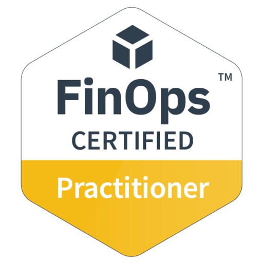
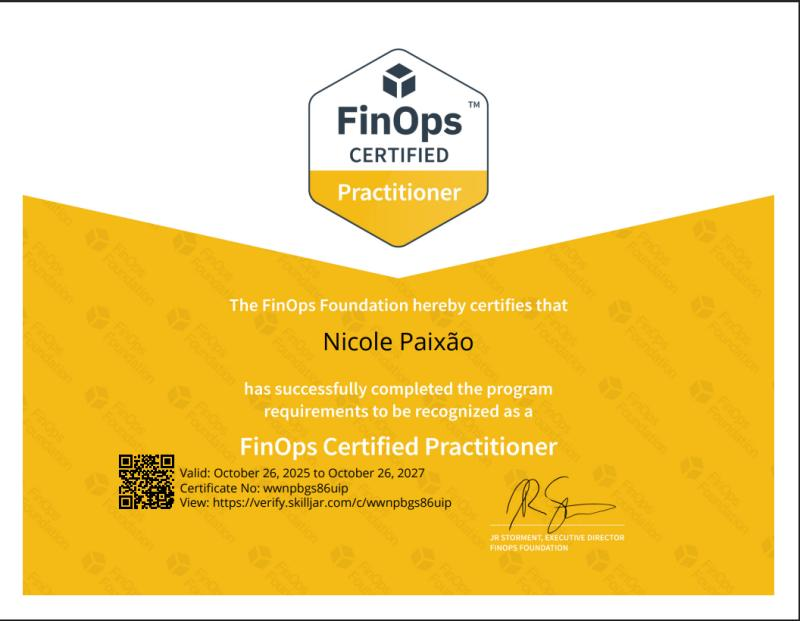

# <samp>FinOps Certified Practitioner</samp>

<samp>FinOps Foundation · October 26, 2025 · <a href="https://verify.skilljar.com/c/wwnpbgs86uip">Verify credential</a></samp>

- - -

<samp>FinOps was the certification that made cloud costs stop feeling abstract. Before it, I could tell you what a Reserved Instance was. After it, I could tell you whether buying one made sense — and prove it with data.</samp>

- - -

## <samp>how I studied</samp>

- FinOps Foundation Certified Practitioner Training — 8h
- Introduction to FinOps · Linux Foundation — 4h
- [FinOps na AWS: Economizando e Gerenciando Custos na Nuvem](https://www.udemy.com/course/finops-na-aws-economizando-e-gerenciando-custos-na-nuvem/) · Udemy

- - -

## <samp>projects I built while studying</samp>

| repo | what it does |
|------|-------------|
| [aws-reserved-instance-expiration-alert](https://github.com/nicoleepaixao/aws-reserved-instance-expiration-alert) | Lambda that monitors RI expirations via Cost Explorer and sends alerts at 90/60/30 days |
| [aws-tagging-compliance-automation](https://github.com/nicoleepaixao/aws-tagging-compliance-automation) | EventBridge + Lambda that enforces tagging policy on EC2, RDS, S3 with a compliance dashboard |
| [aws-nonprod-cost-optimizer](https://github.com/nicoleepaixao/aws-nonprod-cost-optimizer) | Scheduler that stops EC2 and RDS during off-hours using resource tags and EventBridge |
| [karpenter-aws-eks-cost-optimization](https://github.com/nicoleepaixao/karpenter-aws-eks-cost-optimization) | EKS + Karpenter with Spot NodePools and consolidation — cost before/after documented |

- - -

## <samp>certificate</samp>

- - -

<samp>next → [AWS Solutions Architect Associate (SAA-C03)](aws-saa-c03.md)</samp>

[← back](../README.md)
